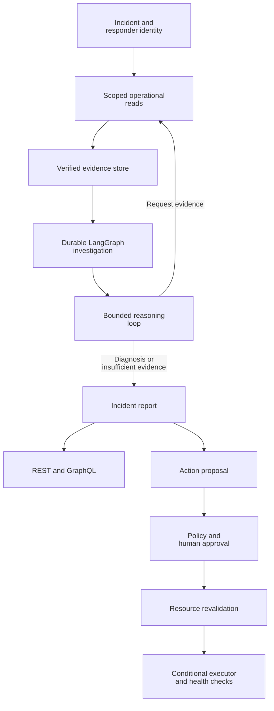

# PayOps

PayOps helps service responders investigate payment failures in Kubernetes. It gathers cluster health, logs, traces, deployment changes and payment telemetry, then produces a diagnosis linked to the observations behind it. Operators can inspect that evidence and route proposed remediation through authorization and approval checks.

A failed payment request can come from an unhealthy dependency, a deployment change, resource pressure or a problem isolated to a processor or payment method. PayOps brings those signals into one investigation so responders can trace a symptom back to its likely cause and review the next action.

## Features

- Scoped readers for Kubernetes, Prometheus, Elasticsearch and payment telemetry.
- Evidence records with source timestamps, incident ownership and content verification.
- A LangGraph investigation workflow with durable checkpoints and reusable completed observations.
- A bounded LangChain reasoning loop with local Qwen and OpenAI provider adapters.
- Authenticated REST and GraphQL access to incidents, reports and evidence.
- Human approval and resource revalidation for permitted Kubernetes remediation.
- Incident memory, OpenTelemetry tracing and opt-in Slack notifications.
- GCS evidence archival, Pub/Sub incident delivery and scoped Google observability readers.

## Run locally

Install Python 3.12 or later and `uv`, then run:

```bash
uv sync --frozen
uv run payops serve
```

Open `http://127.0.0.1:8000/docs` for the API. The development server uses clearly marked fixture investigations. To connect the operational host to your local cluster, follow [operator setup](docs/commands.md), [Kubernetes setup](infra/kubernetes/local/README.md) and [local inference](docs/free-inference.md).

The payment environment is synthetic. Its services exercise payment request flows without transferring funds or changing real account balances.

## How it works

1. A responder submits an incident under a current, namespace-scoped identity.
2. Fixed readers collect relevant observations and store their source records.
3. The investigation validates the evidence and reserves its work budget.
4. The reasoning loop requests another permitted read, returns cited hypotheses or reports insufficient evidence.
5. The host persists the report. Proposed actions pass through a separate policy, approval and execution path.



Backend code owns identity checks, budgets, approvals and execution. Stored observations can be reused after a restart, while uncertain operations require explicit reconciliation.

## Technology

**Python · FastAPI · LangGraph · Kubernetes · PostgreSQL · OpenTelemetry**

Python and FastAPI expose the service, LangGraph coordinates investigations, and Kubernetes supplies operational evidence and the remediation target. PostgreSQL supports persistent application state; OpenTelemetry traces service and model operations. The local operational host uses SQLite checkpoints and filesystem locks.

### Integrations

Configure the integrations your deployment needs:

- **Evidence sources:** Prometheus, Elasticsearch and GKE MCP for metrics, logs, context and scoped cluster reads.
- **Cloud and delivery:** Pub/Sub for incident delivery, GCS for evidence archival and Slack for notifications.
- **Supporting infrastructure:** Redis for derived caches, Google Identity Platform for authentication and Terraform for operator-managed GCP infrastructure.

See the [full technology inventory](docs/architecture.md#technology-inventory) for supporting libraries, model adapters and interface tooling, and [infrastructure setup](docs/deployment.md) for configuration.

## Development

```bash
uv run ruff check .
uv run pyright
uv run pytest
```

## Documentation

Start with the [documentation index](docs/README.md), [architecture](docs/architecture.md), [API contracts](docs/api-contracts.md) and [security boundaries](docs/security.md). The [repository guide](MANIFEST.md) maps the main source directories.
