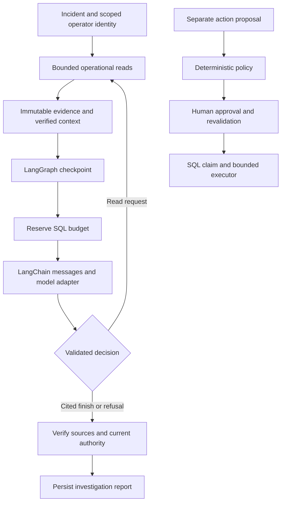

# PayOps

PayOps investigates Kubernetes payment incidents by correlating health, logs, traces, deployment changes and payment telemetry. Each hypothesis cites stored evidence. A bounded LangChain reasoning loop runs inside a durable LangGraph workflow; authorization, budgets and remediation policy execute in ordinary Python outside the model.

Payment failures can look alike at the API boundary. A processor timeout, a bad rollout and a missing trace need different responses. PayOps preserves the observations behind a diagnosis so an operator can inspect its reasoning and decline an unsupported action.

The local implementation runs against a five-service synthetic payment system in `kind`. Cloud deployment, the public replay demo and the full model benchmark are still in progress. No real payments or ledger writes occur.

## Measured so far

| Measurement | Verified result | Scope |
| --- | --- | --- |
| Local fault reproduction | 17 cases with activation and cleanup | Includes kernel OOM, CPU quota throttling, scheduler rejection, trace sampling and a real request-protocol mismatch |
| Diagnosis | 4/4 rank-1 and rank-3 hits | Frozen four-case development run using deterministic ranking |
| Unauthorized capabilities | 120/120 denied; zero executor callbacks | Five forbidden capability types repeated across 24 fixture contexts |
| Approved execution controls | 24 dispatched once; replay added zero callbacks | Instrumented fixture executor |
| Trace correlation | One nine-span path across five services | Historical bounded capture; four other spans retained unresolved parents |

[Results and evidence scope](docs/results.md) distinguish those measurements from the release targets: 24 cases, 83.3% Recall@1, 91.7% Recall@3, 96.4% attribution accuracy, 2.9-minute median investigation, 4.6-second p95 model-step latency and $0.07 average provider cost. The 11.8-minute human baseline also requires measurement. No paid-provider quality, latency or cost result is claimed yet.

## What works

- Fixed Kubernetes, Prometheus, payment and Elasticsearch reads with bounded output, current authorization and incident/service scope checks.
- Immutable evidence artifacts with SHA-256 verification, payment-window arithmetic and nested trace/retrieval source checks.
- Durable investigations that reserve model/read budgets before dispatch and recover completed work without dispatching it again. Uncertain completion stops the run.
- A closed model decision schema for read requests, cited hypotheses and refusal. The OpenAI Responses adapter pins its model, tier and price profile and validates raw provider usage.
- A local operator CLI connects the model and all six read tools with an expiring OS-account grant. Completed restart verifies the journal without issuing new requests; live provider measurements remain pending.
- Deterministic approval policy and an idempotent SQL action broker, with current identity and resource revalidation before execution. The operational mutation executor remains unfinished.
- Firebase identity verification and a protected API factory, tested through intercepted provider responses. The default development server uses mock investigation data.
- PostgreSQL state, Redis derived caching and Elasticsearch retrieval adapters, verified locally with TLS and scoped application identities.
- Fault injectors with original-state journals, bounded synthetic traffic and cleanup verification. The four-stage sampling experiment verifies trace suppression and return while holding processor latency constant.

## Run locally

Use Python 3.12+ and `uv`:

```bash
uv sync --frozen
uv run payops serve
```

Open `http://127.0.0.1:8000/docs`. This command starts the loopback development API and returns explicitly marked mock evidence. It does not configure operational credentials or a public identity tenant.

For development checks:

```bash
uv run ruff check .
uv run pyright
uv run pytest
```

The operational deterministic CLI requires an explicit kubeconfig and external runtime directory. [Commands](docs/commands.md) also documents the model operator host's explicit configuration and read-only plan command. [Local cluster setup](infra/kubernetes/local/README.md) describes the sandbox. Run scenario commands separately from other measurements.

The [static replay app](apps/web/README.md) presents four verified development incidents with clickable citations. It builds locally with Bun and TypeScript; browser verification and public hosting remain pending.

## How an investigation runs



The model cannot choose namespaces, endpoints, SQL, Elasticsearch DSL or shell commands. Logs and retrieved documents remain untrusted data. Budget reservations survive restarts; a timeout limits result acceptance without claiming that a remote request was cancelled. See [reasoning and recovery](docs/reasoning.md) and [policy and approvals](docs/policy-and-approvals.md).

## Stack and deployment status

The implemented local path uses Python, FastAPI, Pydantic, LangChain, LangGraph, SQLAlchemy, PostgreSQL, Redis, Elasticsearch, Kubernetes, Prometheus and OpenTelemetry. CI runs Ruff, strict Pyright, tests, coverage floors and semantic mutation checks. The GKE MCP adapter has a constrained read contract; a deployed GKE integration still needs validation.

The target deployment adds GKE/Cloud SQL/Memorystore, Pub/Sub, cloud evidence storage, AWS processor hosting and a Hugging Face read-only replay demo. Those services are described in the design documents and are not current deployment claims. Public hosting, GraphQL, enterprise SAML configuration, live LangSmith export and the demo recording remain open.

## Documentation

- [Product requirements](PRD.md), [system design](docs/system-design.md), [HLD](docs/HLD.md) and [LLD](docs/LLD.md)
- [Evidence model](docs/evidence-model.md), [reasoning](docs/reasoning.md) and [security](docs/security.md)
- [Scenario catalog](docs/scenarios.md), [frozen release labels](evals/golden/README.md) and [benchmark methodology](docs/benchmark-methodology.md)
- [Results](docs/results.md), [commands](docs/commands.md) and [deployment plan](docs/deployment.md)

Operator journals, failed runs, source hashes, review notes, interview material and the blog draft live outside the code repository in `../resources/pay_ops`. They preserve private runtime evidence separately from source and the future sanitized public demo.

## Work still required

Complete and qualify the remaining scenarios, run the frozen 24-case model evaluation and paired human timing study, then reconcile provider billing. Deployment and the recorded demo follow those working paths. The design documents retain the broader architecture; this README reports the implementation and measurements available today.

