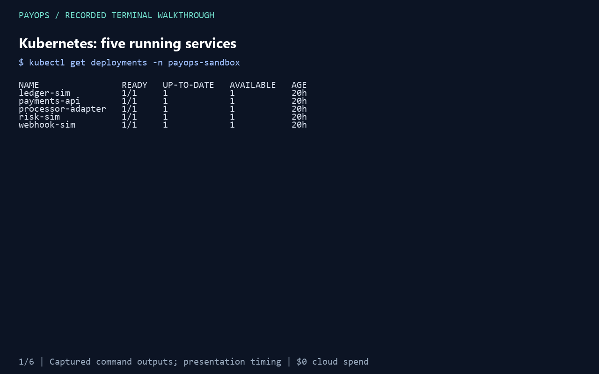
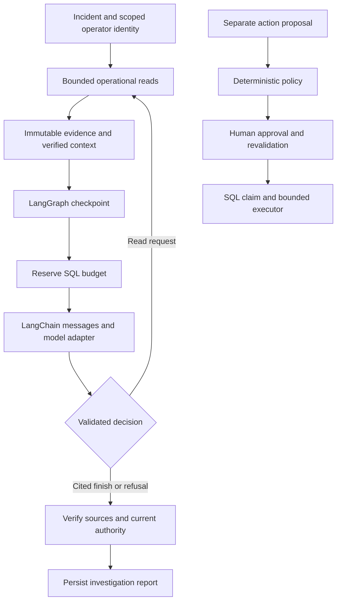

# PayOps

PayOps investigates Kubernetes payment incidents by correlating health, logs, traces, deployment changes and payment telemetry. Each hypothesis cites stored evidence. A bounded LangChain reasoning loop runs inside a durable LangGraph workflow; authorization, budgets and remediation policy execute in ordinary Python outside the model.

Payment failures can look alike at the API boundary. A processor timeout, a bad rollout and a missing trace need different responses. PayOps preserves the observations behind a diagnosis so an operator can inspect its reasoning and decline an unsupported action.

The local implementation runs against a five-service synthetic payment system in `kind`. The [public replay demo](https://huggingface.co/spaces/chinmayarvind/payops-incident-replay) is hosted on a free Hugging Face Static Space. A [24-case local model replay study](docs/model-replay-results.md) is complete; predicate-assisted Recall now reaches 91.7%. No real payments or ledger writes occur.



[Watch the 48-second walkthrough](docs/assets/payops-terminal-demo.mp4). Captured cluster reads, retained scenario receipts and current tests are presented with editorial hold times. This is a terminal walkthrough, not a live fault-injection or browser recording.

## Measured so far

| Measurement | Verified result | Scope |
| --- | --- | --- |
| Local fault reproduction | 24 cases with activation and cleanup | Includes kernel OOM, CPU quota throttling, scheduler rejection, HPA saturation, database/cache outages, misleading telemetry and isolated kubelet eviction |
| Predicate-assisted diagnosis | 22/24 (91.7%) Recall@1 and Recall@3 | Diagnostic predicates plus local Qwen on expanded development evidence; model-only baseline remains 9/24 and 16/24 |
| Local replay latency and cost | 8.414 s median; 15.578 s p95; $0 provider charges | 24 recorded-evidence calls; excludes live collection and human investigation |
| Unauthorized capabilities | 120/120 denied; zero executor callbacks | Five forbidden capability types repeated across 24 fixture contexts |
| Approved execution controls | 24 dispatched once; replay added zero callbacks | Instrumented fixture executor |
| Trace correlation | One nine-span path across five services | Historical bounded capture; four other spans retained unresolved parents |

[Results and evidence scope](docs/results.md) distinguish those measurements from the release targets: 24 cases, 83.3% Recall@1, 91.7% Recall@3, 96.4% attribution accuracy, 2.9-minute median investigation, 4.6-second p95 model-step latency and $0.07 average provider cost. The 11.8-minute human baseline also requires measurement. No paid-provider quality, latency or cost result is claimed yet.

## What works

- Fixed Kubernetes, Prometheus, payment and Elasticsearch reads with bounded output, current authorization and incident/service scope checks.
- Immutable evidence artifacts with SHA-256 verification, payment-window arithmetic and nested trace/retrieval source checks.
- Durable investigations that reserve model/read budgets before dispatch and recover completed work without dispatching it again. Uncertain completion stops the run.
- A closed model decision schema for read requests, cited hypotheses and refusal. The OpenAI Responses adapter pins its model, tier and prices. A [free local Qwen adapter](docs/free-inference.md) uses measured token counts with zero provider charges and no paid fallback.
- A local operator CLI connects either model adapter and all six read tools with an expiring OS-account grant. A live processor-outage investigation diagnosed `PROCESSOR_UNAVAILABLE` in 27.578 seconds with one local model call; replay preserved the completed journal, and scenario cleanup restored healthy payments. See [integration results](docs/operator-integration-results.md).
- Deterministic approval policy, authenticated action routes and an idempotent SQL broker, with current identity and resource revalidation. A closed local executor supports conditional restart, scale and immutable-image rollback with rollout postchecks. Managed synthetic traffic uses a durable SQL pause gate.
- Firebase identity verification and a protected API factory, tested through intercepted provider responses. The default development server uses mock investigation data.
- PostgreSQL state, Redis derived caching and Elasticsearch retrieval adapters, verified locally with TLS and scoped application identities.
- Fault injectors with original-state journals, bounded synthetic traffic and cleanup verification. The four-stage sampling experiment verifies trace suppression and return while holding processor latency constant.

## Run locally

Use Python 3.12+ and `uv`:

```bash
uv sync --frozen
uv run payops serve
```

Open `http://127.0.0.1:8000/docs`. This command starts the loopback development API and returns explicitly marked mock evidence. It does not configure operational credentials or a public identity tenant.

For development checks:

```bash
uv run ruff check .
uv run pyright
uv run pytest
```

The operational deterministic CLI requires an explicit kubeconfig and external runtime directory. [Commands](docs/commands.md) also documents the model operator host's explicit configuration and read-only plan command. [Local cluster setup](infra/kubernetes/local/README.md) describes the sandbox. Run scenario commands separately from other measurements.

The [static replay app](apps/web/README.md) presents four verified development incidents with clickable citations. It builds locally with Bun and TypeScript; public hosting is verified; browser visual verification remains pending.

## How an investigation runs



The model cannot choose namespaces, endpoints, SQL, Elasticsearch DSL or shell commands. Logs and retrieved documents remain untrusted data. Budget reservations survive restarts; a timeout limits result acceptance without claiming that a remote request was cancelled. See [reasoning and recovery](docs/reasoning.md) and [policy and approvals](docs/policy-and-approvals.md).

## Stack and deployment status

The implemented local path uses Python, FastAPI, Pydantic, LangChain, LangGraph, SQLAlchemy, PostgreSQL, Redis, Elasticsearch, Kubernetes, Prometheus and OpenTelemetry. CI runs Ruff, strict Pyright, tests, coverage floors and semantic mutation checks. The GKE MCP adapter has a constrained read contract; a deployed GKE integration still needs validation.

The public replay runs on a free Hugging Face Static Space. An optional [GCP Terraform foundation](infra/terraform/gcp/README.md) defines GKE, networking, private evidence storage and Pub/Sub; it is disabled by default and has not been provisioned. Cloud SQL/Memorystore and cloud worker/storage adapters remain extensions. [LangSmith receipt export](docs/telemetry.md) is implemented and tested without hosted ingestion. AWS has [self-service setup instructions](infra/terraform/aws-lightsail/README.md); no AWS resources were provisioned. See [exact stack coverage](docs/stack-status.md). [Authenticated GraphQL and opt-in Slack notifications](docs/graphql-and-slack.md) are implemented; enterprise SAML tenant configuration remains an extension. The terminal demo is recorded.

## Documentation

- [Product requirements](PRD.md), [system design](docs/system-design.md), [HLD](docs/HLD.md) and [LLD](docs/LLD.md)
- [Evidence model](docs/evidence-model.md), [reasoning](docs/reasoning.md) and [security](docs/security.md)
- [Scenario catalog](docs/scenarios.md), [frozen release labels](evals/golden/README.md) and [benchmark methodology](docs/benchmark-methodology.md)
- [Results](docs/results.md), [commands](docs/commands.md) and [deployment plan](docs/deployment.md)
- [Project article](docs/blog.md), [résumé bullets](docs/resume.md) and [GraphQL/Slack setup](docs/graphql-and-slack.md)

Operator journals, failed runs, source hashes, review notes, interview material and the blog draft live outside the code repository in `../resources/pay_ops`. They preserve private runtime evidence separately from source and the published sanitized public demo.

## Work still required

Validate diagnosis on held-out evidence and collect missing mechanism details for the remaining cases. Local context now prioritizes fresh observations, repeated reads reuse receipts, and [diagnostic predicates](docs/diagnostic-support.md) gate support links. The live host has verified collection, bounded generation, insufficient-evidence completion and recovery, and completed a live processor-unavailable diagnosis in 27.58 seconds with verified fault cleanup. The recorded-evidence study measures diagnosis, replay-call timing and usage; it does not establish full-agent latency or human speedup. The new treatment matches 23/23 citations against a development reference that informed its predicates; independent semantic attribution and paired human investigation time remain unmeasured. The terminal demo is recorded; browser visual verification remains unavailable.

## With more time

- Product: evaluate diagnosis usefulness with responders and measure paired investigation time.
- Architecture: validate the constrained GKE path and cloud worker/storage integrations against deployed resources.
- Engineering: collect held-out incidents, measure quality under missing and adversarial evidence, and test multi-worker contention before expanding beyond the local host.
