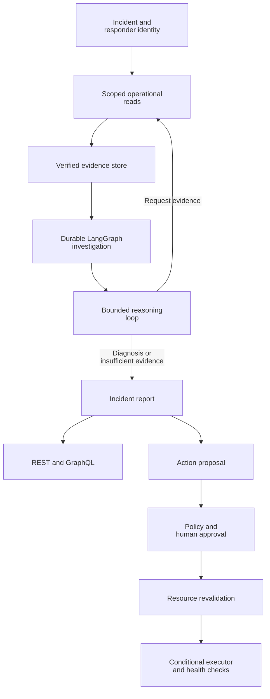

# PayOps

PayOps is an incident-investigation and remediation control plane for engineers operating payment services on Kubernetes. A responder submits a payment failure, PayOps gathers the relevant cluster state, logs, traces, deployment changes and payment telemetry, and returns an evidence-linked diagnosis plus a separately governed remediation path.

**User:** service responders and platform engineers.  
**Input:** an incident, current operator identity and scoped operational evidence.  
**Output:** a cited incident report, ranked hypotheses and, when permitted, an approval-gated remediation proposal.

## Why it matters

Payment failures rarely live in one system. A failed request may come from an unhealthy dependency, a rollout, resource pressure, scheduling, telemetry drift or a processor-specific issue. PayOps brings those signals into one investigation so responders can reason from the same evidence rather than manually stitching together dashboards, logs and deployment history.

## Features

- Scoped readers for Kubernetes, Prometheus, Elasticsearch and payment telemetry.
- Evidence records with source timestamps, incident ownership and content verification.
- A LangGraph investigation workflow with durable checkpoints and reusable completed observations.
- A bounded LangChain reasoning loop with local Qwen and OpenAI provider adapters.
- Authenticated REST and GraphQL access to incidents, reports and evidence.
- Human approval and resource revalidation for permitted Kubernetes remediation.
- Incident memory, OpenTelemetry tracing and opt-in Slack notifications.
- GCS evidence archival, Pub/Sub incident delivery and scoped Google observability readers.

## How it works

1. A responder submits an incident under a current, namespace-scoped identity.
2. Fixed readers collect relevant observations and store their source records.
3. The investigation validates the evidence and reserves its work budget.
4. The reasoning loop requests another permitted read, returns cited hypotheses or reports insufficient evidence.
5. The host persists the report.
6. Proposed actions pass through a separate policy, approval, resource-revalidation and execution path.



Backend code owns identity checks, budgets, approvals and execution. Stored observations can be reused after a restart, while uncertain operations require explicit reconciliation rather than being silently replayed.

## Failure scenarios and recovery

PayOps includes controlled failure scenarios for the synthetic payment environment so investigation behavior can be exercised against concrete operational faults. Scenario tooling covers deployment, dependency, scheduling, resource and telemetry-related failures, while the remediation path keeps diagnosis separate from authorization and execution.

Recovery behavior is designed around explicit state:

- completed observations can be reused after workflow restart;
- evidence is retained with timestamps and source identity;
- uncertain operations require reconciliation before the workflow proceeds;
- remediation revalidates the target resource before execution;
- postchecks are part of the action path rather than an implicit assumption.

See [failure scenarios](docs/scenarios.md), [tool contracts](docs/tool-contracts.md) and [incident memory](docs/incident-memory.md).

## Design tradeoffs

- **Deterministic authority over model authority:** the reasoning loop can request evidence and propose a diagnosis, but identity, budgets, approvals and execution remain in backend code. This adds explicit control-plane steps in exchange for inspectable authority boundaries.
- **Evidence first, action second:** remediation is intentionally separated from investigation. The extra handoff prevents a plausible diagnosis from automatically becoming a cluster mutation.
- **Durable checkpoints over stateless retries:** persisted observations make investigations resumable and auditable, at the cost of additional state-management and reconciliation logic.
- **Scoped readers over unrestricted shell access:** integrations expose fixed operational capabilities instead of arbitrary commands, trading flexibility for a smaller and more reviewable execution surface.

## Technology

**Python · FastAPI · LangGraph · Kubernetes · PostgreSQL · OpenTelemetry**

Python and FastAPI expose the service, LangGraph coordinates investigations, and Kubernetes supplies operational evidence and the remediation target. PostgreSQL supports persistent application state; OpenTelemetry traces service and model operations. The local operational host uses SQLite checkpoints and filesystem locks.

### Integrations

Configure the integrations your deployment needs:

- **Evidence sources:** Prometheus, Elasticsearch and GKE MCP for metrics, logs, context and scoped cluster reads.
- **Cloud and delivery:** Pub/Sub for incident delivery, GCS for evidence archival and Slack for notifications.
- **Supporting infrastructure:** Redis for derived caches, Google Identity Platform for authentication and Terraform for operator-managed GCP infrastructure.

See the [full technology inventory](docs/architecture.md#technology-inventory) for supporting libraries, model adapters and interface tooling, and [infrastructure setup](docs/deployment.md) for configuration.

## Run locally

Install Python 3.12 or later and `uv`, then run:

```bash
uv sync --frozen
uv run payops serve
```

Open `http://127.0.0.1:8000/docs` for the API. The development server uses clearly marked fixture investigations. To connect the operational host to your local cluster, follow [operator setup](docs/commands.md), [Kubernetes setup](infra/kubernetes/local/README.md) and [local inference](docs/free-inference.md).

The payment environment is synthetic. Its services exercise payment request flows without transferring funds or changing real account balances.

## Development

```bash
uv run ruff check .
uv run pyright
uv run pytest
```

## Key files

- [Documentation index](docs/README.md)
- [Architecture and technology inventory](docs/architecture.md)
- [API contracts](docs/api-contracts.md)
- [Security boundaries](docs/security.md)
- [Failure scenarios](docs/scenarios.md)
- [Tool contracts](docs/tool-contracts.md)
- [Incident memory](docs/incident-memory.md)
- [Operator commands](docs/commands.md)
- [Repository map](MANIFEST.md)
