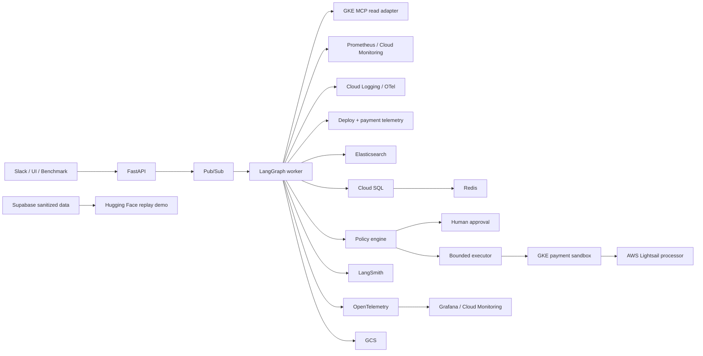

# High-Level Design

## Planes

**Payment data plane:** synthetic payment services and external processor simulator.

**Incident control plane:** evidence collection, orchestration, diagnosis, policy, action, and postcheck.

**Safety plane:** capabilities, deterministic policy, approval, and executor identity.

**Public presentation plane:** Vercel and Hugging Face surfaces with sanitized or authorized views.
