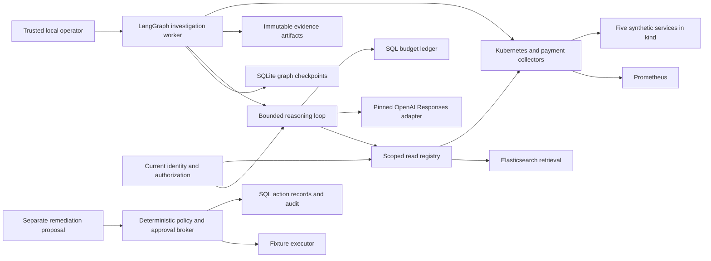
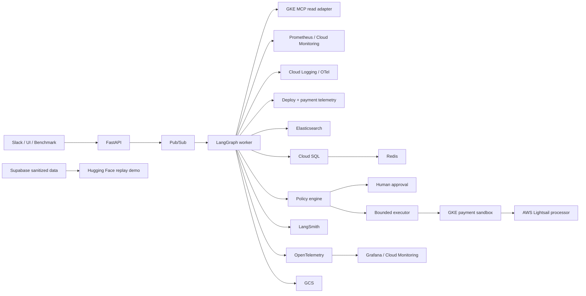

# High-Level Design

## Implemented local architecture

The local worker runs a native LangGraph with SQLite checkpoints and per-incident file
locks. Its collector reads the synthetic `kind` cluster and Prometheus. An optional
reasoner uses LangChain messages, a bounded provider adapter and six fixed read tools.
SQL budget reservations and immutable evidence receipts make completed operations
replayable without repeating remote work. The default worker uses deterministic ranking.

The OpenAI adapter is verified through synthetic transport tests; paid calls and a
live model benchmark remain open. PostgreSQL, Redis and Elasticsearch adapters have
separate local TLS integration evidence. The graph's SQLite checkpoint store is a
single-host implementation; deploying multiple workers requires a shared checkpoint
backend and distributed ownership. Redis cache contents never authorize an action.

The protected API factory verifies identity and scope, but the default `payops serve`
command exposes only the loopback mock path. The approved-action broker has a fixture
executor. Public login, model operator hosting and operational mutation deployment
must not be inferred from their component tests.

## Target cloud architecture

The diagram below remains the deployment target. Pub/Sub delivery, cloud storage,
GKE runtime, AWS hosting and the public replay surfaces are not yet deployed results.

## Planes

**Payment data plane:** synthetic payment services and external processor simulator.

**Incident control plane:** evidence collection, orchestration, diagnosis, policy, action, and postcheck.

**Safety plane:** capabilities, deterministic policy, approval, and executor identity.

**Public presentation plane:** Vercel and Hugging Face surfaces with sanitized or authorized views.

The concurrency-memory experiment isolates each traffic stage in a fresh payments
process. It restores the captured deployment between stages and reapplies the same
worker configuration. This adds rollout time to the operator experiment but keeps
memory attribution independent across serial control, parallel treatment and serial
recovery. Experiment duration is not agent investigation latency. Live qualification
still requires raw evidence review and verified final restoration.

The autoscaling experiment separates synthetic load ownership from payment-service
replica health. A load Job is accounted for through its controller and process
identity before service validation; its mere presence does not prove successful
traffic or autoscaling. Live qualification remains pending.

## Free public deployment and revised AWS scope

The owner requested free Hugging Face hosting and optional AWS instructions only.
The four-case replay now runs as SDK `static` with no paid compute or database.
Space: https://huggingface.co/spaces/chinmayarvind/payops-incident-replay
HF revision: ccdbfdbc1e3473cbbeb1ab2acafecfc1a0b2c23d.
The static host is returned by the API and ends in `.static.hf.space`; the Docker
hostname is not valid for this SDK. Served JS/CSS match release bytes exactly.
Served HTML matches after removing HF's metadata script and normalizing line ends.
All four repository files match the release. Application CSP resides in HTML;
Nginx-specific headers and health routes are not claimed on Static hosting.
Evidence: audit/evidence/hf-static-deployment-v2/verification.json.
Browser inventory is empty, so layout/click verification and recording remain open.
AWS was not provisioned; infra/terraform/aws-lightsail/README.md provides optional
setup and explicitly identifies the unfinished cloud processor adapter.

Autoscaling qualification now correlates controller cap status, independent CPU
metrics, actual replica identities and per-request kernel work. Capacity remains
limited at two replicas; the experiment demonstrates real scale-out and restores
the original workload afterward. Local qualification now covers18of24cases.
